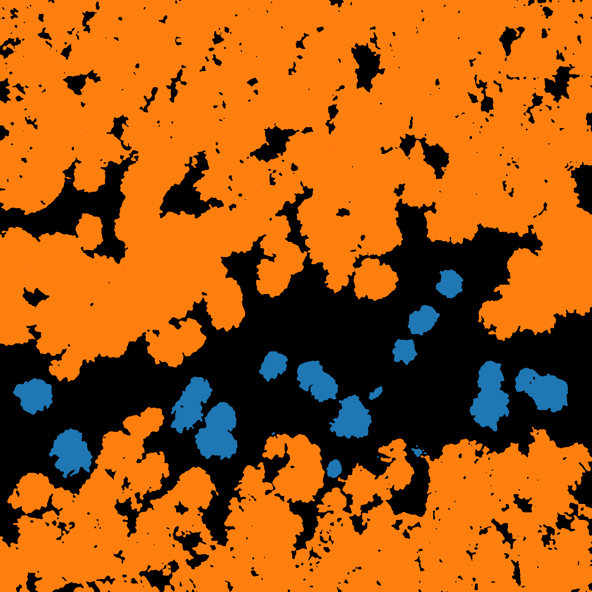

# A ConvNeXt based model for tree detection

<table>
  <tr>
    <td></td>
    <td></td>
  </tr>
</table>

A ConvNeXt based U-net model trained to detect **individual trees** and **clusters of trees** in satellite images.

**Blue** pixels represent individual trees, whereas **Orange** pixels represent clusters of trees (that can also include forested areas).

**How to test images?**
1) Install all the libraries used in the file `convunext_test_final.py` and then run the file.
2) Specify the paths to the `.onnx` file, input image file and the output directory.
3) Specify perameter values for minimum accepted area for individual trees and cluster of trees

The **ONNX** file is located in the following repository: 
[https://doi.org/10.5281/zenodo.13800136](https://doi.org/10.5281/zenodo.20573673)

_______________________________________________________________________________
For training this model, images were collected from the following projects: - 
1) [NeonTreeEvaluation: RGB Dataset](https://datasetninja.com/neon-tree)
2) [TOF_Detection](https://github.com/Taoorwell/TOF_Detection/)
