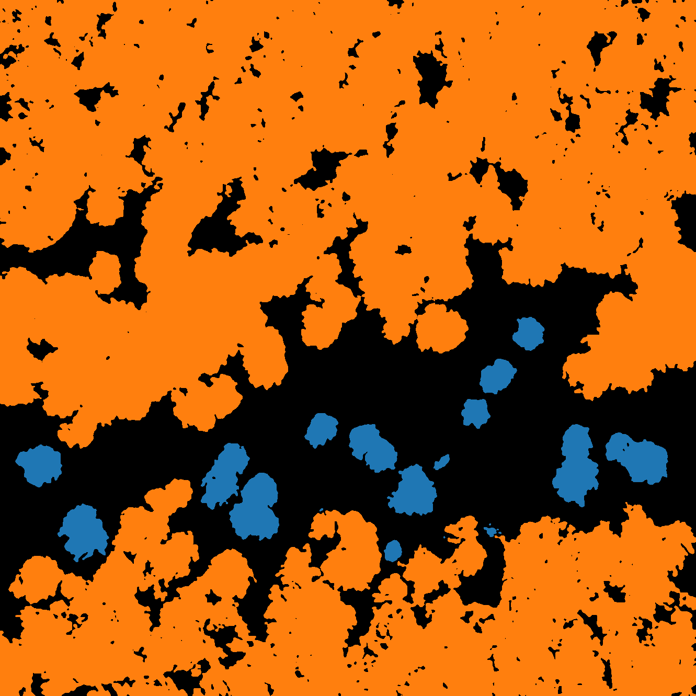

# A ConvNeXt based model for tree detection

<table>
  <tr>
    <td></td>
    <td></td>
  </tr>
</table>

A ConvNeXt based U-net model trained to segment two classes of trees in 2D satellite images:
**Class 1** segments individual trees and trees from sites of low vegetation density. 
**Class 2** segments trees from sites of high vegetation density.

**Blue** pixels represent Class 1, whereas **Orange** pixels represent Class 2 (that can also include forested areas).

## How to test images?
1) Install all the libraries used in the files `convunext_to_onnx.py`, `convunext_test_final_1.py` and `remove_noise_1.py` located inside the directories `training_pipeline` and `testing_pipeline` respectively.
2) Run the file `convunext_test_final_1.py`.
3) Specify the paths to the `.onnx` file, input image file and the output directory.
4) Specify perameter values for ***'minimum cluster area in terms of multiple of tree area'*** and ***'minimum cluster area (in %)'***.

The **ONNX** file is located in the following repository: 
[https://doi.org/10.5281/zenodo.21714497](https://doi.org/10.5281/zenodo.21714497)


## Citation
If you find this tool helpful in your work, please cite the following
```
@misc{zenodo_project_2026,
  title={A ConvNeXt based model for tree detection},
  author={Kalita, Nehal and Alahari, Yukteshwar and Maurya, Rajesh Kumar},
  month={June},
  year={2026},
  publisher={Zenodo},
  url={https://doi.org/10.5281/zenodo.21714497}
}
```

_______________________________________________________________________________
For training this model, images were collected from the following projects: - 
1) [NeonTreeEvaluation: RGB Dataset](https://datasetninja.com/neon-tree)
2) [TOF_Detection](https://github.com/Taoorwell/TOF_Detection/)
